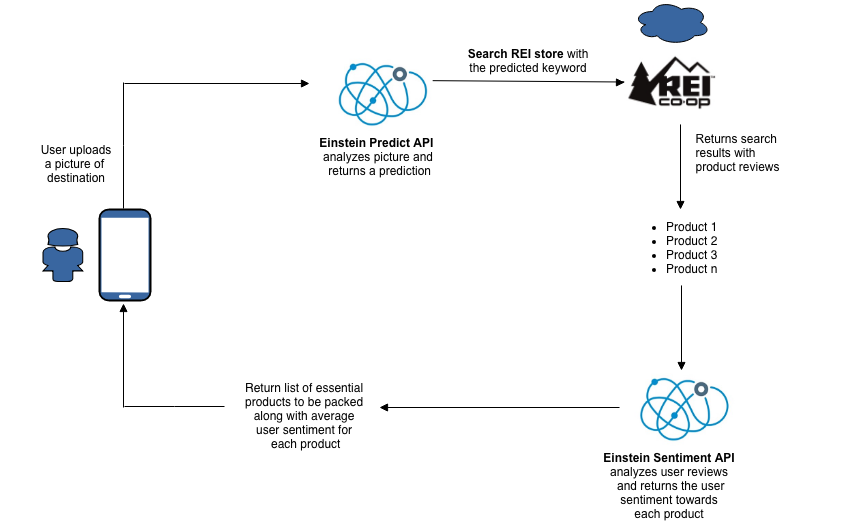
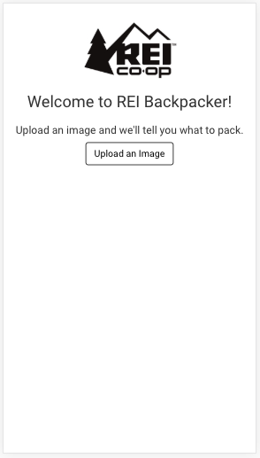
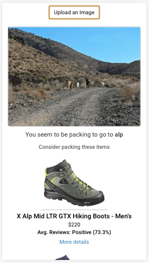
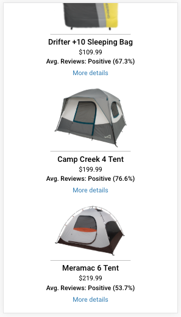
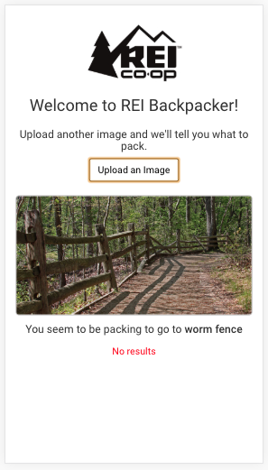

# rei-backpacker
A Responsive web application that suggests users what to pack based on the uploaded picture. The image is analyzed by Einstein Vision API and appropriate products are fetched from REI. Einstein also reads the product reviews and displays the average sentiment of the user reviews for each product. 

Website - https://suhasd.com/rei-backpacker/

*Please use Allow-Control-Allow-Origin: * (v1.0.3) Google Chrome plugin to run this example*

## Part 1 - Ideation
### Problem: 

Different places require us to pack different things. Snowy conditions require us to pack down jackets, gloves and beanie where as the beach requires us to pack shorts, sunscreen and shades. Most of the times, **we forget to pack the essentials**. 

### Solution: 

An application that allows the user to upload a picture of the destination and the **Einstein Predict will analyze and suggest the items to pack for that condition.** If the user does not have the product, the application allows the user to click on the product and purchase it from the REI website. 

To make the purchase decision quicker, **Einstein Sentiment analyzes all the user reviews of the product and displays the average user sentiment towards the product** (positive/negative/neutral). 

### User Story:

Jon and Ivy are a couple who loves travelling. Everytime they pack for a vacation, they run into disputes like “Did you really need to pack two pairs of hiking shoes for the beach? I could not fit my shorts because of you!” Most of the times, they forget the essentials and keep running into disputes. At some point, the couple decide to look online for backpacking help and come across REI Backpacker. REI Backpacker allows them to upload a picture similar to their destination. Based on the picture, the **application predicts whether the couple is going to a tropical destination or to snow-capped mountains.** The application then suggests the essential products which the couple need to pack for that destination. 

Ivy exclaims "But I dont have hiking shoes!". Thankfully, the **application lets user purchase products from REI**. To make the decision quicker, the application also shows average user sentiment towards the product based on the reviews. Jon suggests "No problem, lets order this pair of shows, they have **94% positive user feedback.**" They place the order and eventually get ready for the vacation.

### Solution Architecture diagram

## Part 2 - Mobile Application
### Screenshots:

Application landing             |  Essential Products 
:-------------------------:|:-------------------------:
  |  

User Sentiment from reviews       |  No results
:-------------------------:|:-------------------------:
  |  

### Technical Stack:

1. **jQuery** for quick prototyping
2. **Bootstrap** for Responsive UI
3. **AJAX** for Webservices interaction

I tried to implement the application with **React JS in Progressive Web Application standard** but I faced the challenge of CORS (Cross Origin Resource Sharing) as I was making requests from front-end. I spent considerable amount of time in setting up **backend server using NodeJS and ExpressJS.** Even then, I could not resolve CORS issue.

Hence, I used jQuery for quick prototyping along with Chrome extension **Allow-Control-Allow-Origin: * (v1.0.3)** to run on **Google Chrome with responsive design mode.** Please use the same plugin to validate the application for now.

## Improvements

1. Implement backend server to handle CORS issue
2. Improve performance by getting rid of async:false
3. Train dataset with inputs from Predict API to give better suggestion from REI
4. Implement using better technical stack.
5. Get rid of hardcoded user reviews examples
6. Get actual reviews for each product and run Einstein Sentiment API

Website for demo - https://suhasd.com/rei-backpacker/

